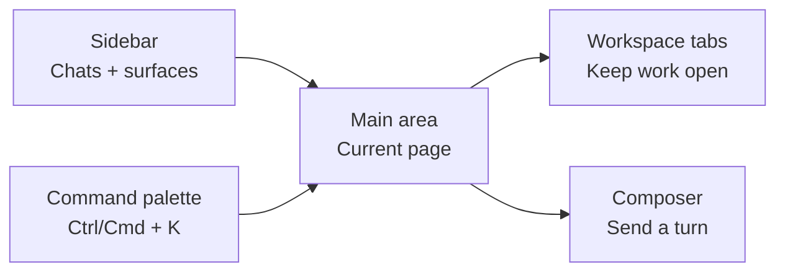

This page is a quick orientation to the Ryu desktop app: where things are and what each area does.

<SurfacePreview surface="chat" />

## The shell in one picture

The same four areas work together on every desktop surface:

## Layout

The desktop is organized into three parts:

- **Sidebar** (left) - your entry points and chat history. It holds **New chat**, **Search chats**, quick links to **Agents**, **Models**, and **Skills**, and the running list of your past conversations.
- **Main area** (center) - the active page, usually the chat view, but it switches to whatever page you open.
- **Tabs** (top) - pages open as tabs so you can keep several surfaces open at once and switch between them.

## Navigation

Press **Ctrl+K** (or **Cmd+K**) to open the command palette and jump to any surface. The full set of pages includes:

- **Chat** - talk to your agents.
- **Agents** - browse, create, and configure agents.
- **Services** - run background helpers for agents.
- **Engines** - choose how Ryu runs an agent.
- **Models** - find and install models that run on your computer.
- **Skills** - add instructions that teach an agent how to do a task.
- **Spaces** - keep notes and files an agent can search.
- **Tools** - give agents access to services and actions. Developers may see MCP servers here.
- **Workflows** - run several steps in order.
- **Calendar** - scheduled events and time-based context.
- **Timeline** - chronological activity view.
- **Monitors** - background watchers and alert conditions.
- **Tasks** - auto-detected todo list (Quests); tracks items from your conversations.
- **Approvals** - requests that need your sign-off before they can run.
- **Meetings** - meeting notes and audio capture.

Use the back and forward buttons in the top-left navigation cluster to walk through
recently opened tab views. The same navigation is available with **Alt+Left** and
**Alt+Right**, or with a mouse's dedicated back and forward buttons.

The palette also shows filter tabs directly under the search field. **All** keeps the
global actions and navigation together; the other tabs narrow results to the matching
sidebar section, such as Chats, Spaces, Workflows, Skills, or Tools. App-contributed
sidebar sections receive their own tab automatically when the app is enabled, so an
installed app does not need a separate command-palette registration.

On Desktop, press **Ctrl+.** (or **Cmd+.** on macOS) to open Settings, or **Ctrl+,** (or **Cmd+,**) to open Gateway settings. To customize shortcuts, open **Settings → Keyboard Shortcuts**. Use the large filter field at the top of that tab to narrow actions by name, category, description, or key binding; the shortcut list scrolls independently below the filter. Select **Reset all to defaults** beside the filter to restore every in-app shortcut in one step.

The account control in the sidebar footer opens the user menu. Choose the current
account at the top of that menu to open the account submenu, where you can switch
accounts, add another account, sign out an individual account, or **Log out of all
accounts**.
Choose **Invite a friend** in the same menu to open the web referral page.

### Scroll horizontal rows with the mouse wheel

When the pointer is over a row that scrolls horizontally but has no vertical
overflow, roll the mouse wheel up or down to move the row left or right. Trackpad
swipes that already include horizontal movement continue to work normally. Areas
that also scroll vertically keep their usual behavior, and when a horizontal row
reaches an edge, the surrounding page can continue scrolling.

<Callout type="info">
  Some controls open in dialogs instead of pages. **Gateway** controls model choice, safety,
  budgets, channels, and identities. **Memory** and **Credits** are tabs inside Settings.
</Callout>

## Notifications and announcements

Inbox items and announcement banners can share one compact notification stack in the
sidebar footer, similar to the notification trays on iOS, iPadOS, and macOS. Open
**Settings → Appearance → Interface → Notification layout** and move the slider to
choose the display:

- **Split** keeps the announcement stack above the account footer and the Inbox in
  its own tray.
- **Grouped** puts both in one tray while keeping separate Approvals, Notifications,
  and Announcements sections.
- **Unified** blends approvals, tasks, app notifications, and announcements into one
  expandable stack. The full Inbox remains available from the tray footer for detail.

The Inbox page and its sidebar notification popover also share notification filter
pills. **All** shows every notification, **Unread** keeps only live rows that still
need attention, and **Archived** shows rows you have put away. Additional pills are
created for each notification level (such as **Info**, **Success**, **Warning**, or
**Error**), so you can scan one kind of alert without changing the underlying feed.
Archiving marks a row read; use **Restore to inbox** from **Archived** or **All** to
bring it back.

Click an announcement banner to open its detail dialog. Admin-authored images and
animated React-rendered scene definitions stay out of the compact banner and load
only in that dialog, over the same flowing warp treatment used by the 3D waitlist
pass. The newest unread announcement opens there automatically when the announcement
surface first loads; opening it marks it read. Announcement authors can choose the
image, warp color stops, and scene layers from the admin dashboard.
They can also add a large universal-library icon or upload a custom icon; the
custom icon is layered over the banner image when both are present. The detail
icon picker can add the same dither background used by app and plugin icons, or
admins can provide an app/plugin-style flat icon background.

The setting updates the sidebar immediately and is included in Appearance reset and
settings sync.

## Interface vocabulary

Open **Settings → Appearance → Interface → Use Bot terminology** to replace visible
Agent, agent, Agents, and agents labels with Bot, bot, Bots, and bots. The setting is
enabled by default, preserves normal capitalization, and leaves technical identifiers
and user-authored chat text unchanged. **Ryu Work** interface mode always turns it
on; switch to **Code** before turning it off.

Ryu Work also starts in the built-in **Agents view** sidebar. It opens on the **Agents**
tab and keeps **Sessions** as the other side of the toggle, so everyday users do not
need to install or enable a separate app or plugin to find their bots. Code users can
choose another sidebar arrangement from the same Appearance controls or the sidebar
context menu.

## Split view

Tabs can be shown side by side. A **split view** places two or more tabs in the main content area at once, as either **columns** (side by side) or **rows** (stacked).

- Press **Ctrl+Alt+S** (or **Cmd+Alt+S**) to toggle a split view on the active tab.
- Tab context menus also create, drop a tab from, or dissolve a split.
- Drag the gutter between two panes to resize them.

<Callout type="info">
  Panes are positioned independently, so switching focus between panes never reloads a page.
</Callout>

## Tab appearance

By default, open tabs live in a small searchable list in the title bar. Turn off
**Settings → Appearance → Interface → Show tabs as a dropdown** to show every tab in the title bar.
In that view, tabs use floating pills by default. Turn off **Settings → General → Tabs → Floating
tabs** to make the active tab use the page color instead. Pinned tabs, groups, drag-and-drop, and
tab actions still work.

In dropdown mode, click the active-tab trigger to open **Search open tabs**. Type a
title or route to narrow the list, select a result to switch to it, or use its close
button to close it. In full-strip mode, use the chevron beside the **+** button for
the same searchable list. Right-click the chevron to hide the button; restore it from
**Settings → Appearance → Interface → Show tab search button**.

The main tab and sidebar settings are also available in place. Right-click empty
sidebar space to change the sidebar mode or style, list grouping, project and Space
navigation, chat previews, section overflow, or agent-row presentation.
Right-click the title-bar tab area to toggle the tab dropdown, tab search button,
floating tab pills, or other title-bar behavior. These context-menu changes update the
same saved Appearance preferences as Settings.

### Center-pane tab views

Right-click any tab and choose **Tab view** to switch between four ways of working:

- **Horizontal tabs** keeps the compact title-bar strip.
- **Vertical tabs** moves the open-tab list into the sidebar.
- **Scrollable tabs** turns the center pane into a long horizontal track of live
  tab cards. Scroll or use the arrow keys to move between focused and unfocused
  tabs.
- **Infinite canvas** turns every open tab into a live, draggable canvas pane.
  Existing tab groups and split groups appear as colored regions around their
  member panes; pan, zoom, resize, and use **Fit all** to arrange the view.

The tab and split groups stay the same when you change views. An unloaded tab keeps
its memory-saving state and reloads when you focus it. On a narrow window, Ryu keeps
the normal horizontal tab strip so the active page remains easy to reach.

For a more focused browsing mode, turn on **Settings → Appearance → Interface → Blur
popup backgrounds**. While enabled, dropdowns, selects, popovers, context menus, and
navigation menus softly dim and blur the app behind the active surface. It is off by
default and does not change full dialogs; **Blur dialog backgrounds** remains the
separate control for dialogs, action dialogs, sheets, and drawers.

## Renaming tabs

Double-click a tab's title to rename it inline. The rename applies where the tab is
named for something you own:

- **Chats** rename the conversation (also shown in the sidebar).
- **Space pages** - documents, databases, and app-owned pages - rename the page itself.

Tabs whose title comes from a route (Settings, Library, the store) have nothing to
rename, so a double-click just activates the tab. Commit with **Enter**, cancel with **Esc**.

## Background customization

You can give the sidebar and the page area custom backgrounds from **Settings → Appearance**. Each surface takes an independent background built from up to three layers composited top to bottom: an overlay tint, a custom image, and a linear gradient.

- **Gradient** - two hex colors and an angle.
- **Image** - any picked image, with fit options (cover, contain, stretch, center, tile) and a scale.
- **Overlay** - a tint layered over the image for legibility.

Changes apply at once and stay saved on this device.

<Callout type="info">
  Backgrounds are off by default. The Calendar and Timeline pages draw their own surface, so they occlude a page background image.
</Callout>

## The Island companion

Ryu ships a separate **Island** companion. It is a small floating window that stays above your
other windows on Windows and macOS. See
[Island](/docs/surfaces/island) for what it does and how consent works.

Read on for [Agents](/docs/surfaces/desktop/user-guide/agents),
[Chat Features](/docs/surfaces/desktop/user-guide/chat),
[Agent Groups](/docs/surfaces/desktop/user-guide/teams),
[The App Store](/docs/surfaces/desktop/user-guide/store),
[Spaces and Memory](/docs/surfaces/desktop/user-guide/spaces-memory),
[Data Folder & Storage](/docs/surfaces/desktop/user-guide/data-and-storage),
[Account Security](/docs/surfaces/desktop/user-guide/account-security), and
[Deep Links](/docs/surfaces/desktop/user-guide/deep-links).
