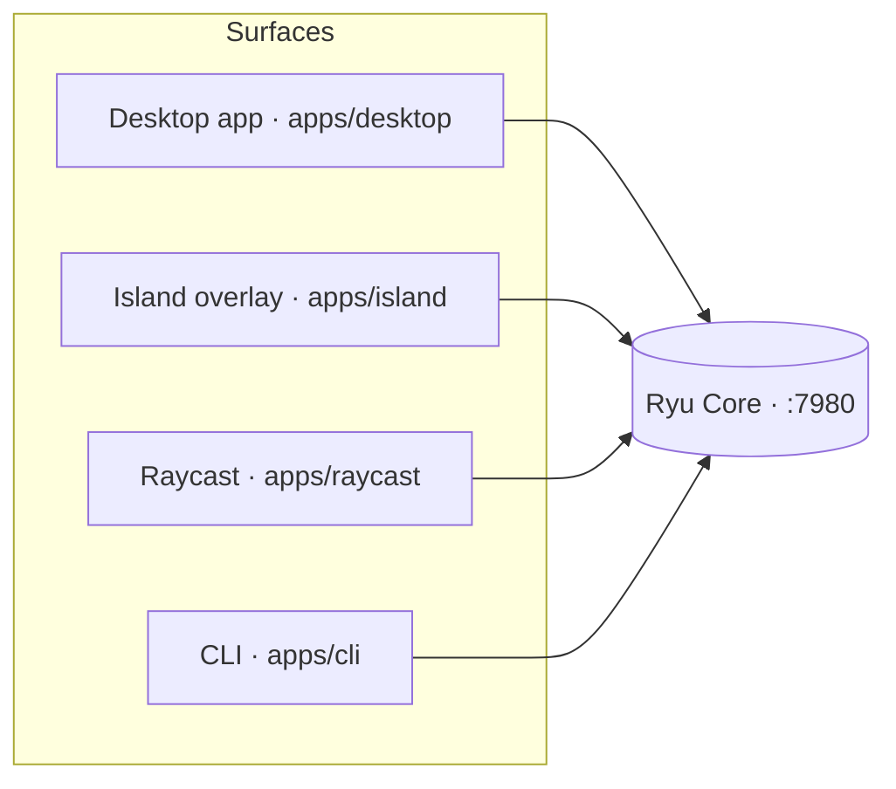

Ryu is a local backend with many doors. Every surface here is a thin client over the **same Core**
(the local backend on `:7980`) and the same Gateway, so switching surfaces never switches context: a
chat you start in the desktop app is the same conversation you open in the CLI or from the Island.

## Shipped surfaces

<Cards>
  <DocCard href="/docs/surfaces/desktop" />
  <DocCard href="/docs/surfaces/island" />
  <DocCard href="/docs/surfaces/raycast" />
  <DocCard href="/docs/surfaces/cli" />
</Cards>

## At a glance

| Surface | Stack | Reaches Core | Maturity |
|---|---|---|---|
| Desktop app | Tauri / TS | direct | Full |
| Island overlay | Electron | mini chat + command transport | Built (live summon unverified) |
| Raycast | `ray` CLI / TS | direct (no CORS) | Built (source syntax-verified) |
| CLI | Rust TUI (`ryu`) | direct | Full |

Additional clients are developed separately from the shipped desktop, Island, Raycast, and CLI
surfaces documented here.

## See also

<Cards>
  <DocCard href="/docs/start-here/architecture/core-vs-gateway" />
  <DocCard href="/docs/core/node-and-presence" />
  <DocCard href="/docs/core/conversations-sessions" />
</Cards>
