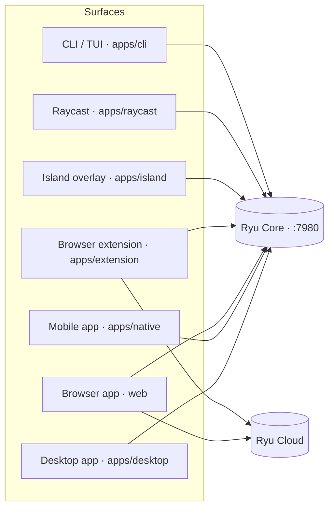

Ryu has several clients with different strengths. **Ryu Bot** is the managed consumer surface,
**Ryu OS** is the agent-first desktop workspace, and **Ryu Console** is the power-user and admin surface. Mobile, browser, companions, extensions, and
terminal clients are additional surfaces that can connect to the same Core server. Ryu Infra can be
Ryu Cloud managed or self-hosted. When a client connects to the same server, a chat keeps its
conversation and context as you move between surfaces.

## Shipped surfaces

<Cards>
  <DocCard href="/docs/surfaces/desktop" />
  <DocCard href="/docs/mobile" />
  <DocCard href="/docs/surfaces/webapp" />
  <DocCard href="/docs/browser-extension" />
  <DocCard href="/docs/surfaces/island" />
  <DocCard href="/docs/surfaces/raycast" />
  <DocCard href="/docs/surfaces/cli" />
</Cards>

## Surface-specific capabilities

| Surface | What belongs to this surface |
|---|---|
| Ryu OS / desktop workspace | Dock, live App windows, App Launcher, and desktop wallpaper controls |
| Ryu Console / desktop app | Native windows, local engines and sidecars, and media picture-in-picture (PiP) |
| Mobile app | Desktop-shell wrapper plus `llama.rn` on-device models, notifications, Live Activities, haptics, and device tools |
| Browser app | Desktop-shell wrapper plus anonymous browser sessions, local Core setup, Cloud fallback, and browser navigation |
| Browser extension | Desktop-shell wrapper plus browser-local Transformers.js inference, in-page copilot, and browser tools |
| Island | Global overlay, command palette, context suggestions, voice input, and dictation |
| Raycast | One-shot questions, multi-turn chat, and conversation search from Raycast |
| CLI / TUI | HTTP/SSE chat, keyboard navigation, and terminal list and table renderers |

These capabilities are host-specific. Shared Core APIs, conversations, agents, permissions, and
provider routing remain portable, but a client must feature-detect native effects and rich views.

## Shared shell inheritance

The Desktop shell is the reference composition contract for Marketplace contributions. The hosted
Web app, Mobile app, and Browser extension reuse that contract through their own bridges, so a
package can support those clients without shipping three unrelated navigation systems. Marketplace
detail rows label this relationship as **inherited from Desktop**.

Inheritance applies to shell composition only. Desktop window chrome, tray behavior, filesystem
pickers, updater controls, Mobile notifications/haptics, and browser page APIs remain host-specific.
Apps should use `host.capabilities` or the native bridge to feature-detect those effects. A package
that extends `browser.control` is extending the Browser capability, not taking ownership of the
Desktop or Mobile shell.

## See also

<Cards>
  <DocCard href="/docs/start-here/architecture/core-vs-gateway" />
  <DocCard href="/docs/core/node-and-presence" />
  <DocCard href="/docs/core/conversations-sessions" />
  <DocCard href="/docs/extend/develop/extensions/native-bridges" />
</Cards>
