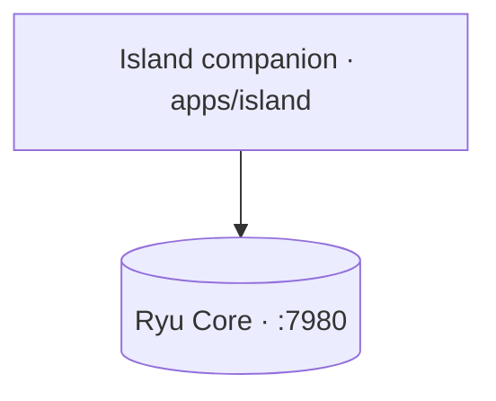

The **Island** (`apps/island`) is an Electron dynamic-island overlay that rides alongside the
desktop app on the same machine. It talks to the same Core (`:7980`), so it shares your
conversations, agents, and Gateway routing — switching from the app to the Island never switches
context.

The Island **hosts the command bar** (the former standalone `apps/command` launcher was merged in).

- It runs **Shadow** context monitoring (`:3030`) plus a **local-model proactive engine** that
  surfaces suggestion chips, and a **mini chat** onto Core (`:7980`).
- A global hotkey expands the resting pill into a **command palette / mini-chat** (the `command`
  expanded view) over a `window.island` transport (`apps/island/src/renderer/command-transport.ts`),
  reusing the `@ryu/blocks` command-bar shell and the island's `island-agents` voice-agent pref.
- Every capability the companion uses is behind a **per-capability consent gate**, so nothing reads
  your screen or audio until you allow it. Consent mirrors the Core `island-consent` pref, so a
  desktop grant opens the Shadow gate without a first-run card.

<Callout type="warn">
  The Island is built, but its live hotkey summon, focus handling, and context loop are unverified:
  they need a real display to exercise. Shadow context capture is cross-platform.
</Callout>

## System-wide dictation

The Island also hosts **system-wide dictation** - a separate global shortcut (default
`CommandOrControl+Shift+D`) that captures speech and types the transcript straight into whatever
native app has OS focus. This is distinct from the Island's voice input, which drops what you say
into the Island chat to run an agent; dictation just types.

Insertion goes through **Ghost** (`apps/island/src/main/services/dictation.ts`): the transcript is
sent to Core's tool call endpoint as a `ghost.ghost_type` action with no target app, so it lands in
the currently focused window. Paste mode uses the clipboard plus a Ghost hotkey instead, and an
optional post-process step can clean the transcript up first. The shortcut deliberately never
focuses the Island - stealing focus would break typing into your target app.

<Callout type="warn">
  Dictation is a companion feature that needs a display, a microphone, and the Ghost sidecar to
  exercise, so it is not yet live-verified. The preference lives at `DICTATION_PREF_KEY`
  (`apps/island/src/shared/dictation.ts`); configure it in the desktop under the Island settings.
</Callout>

## See also

<Cards>
  <DocCard href="/docs/surfaces/desktop" />
  <DocCard href="/docs/core/conversations-sessions" />
  <DocCard href="/docs/core/node-and-presence" />
</Cards>
