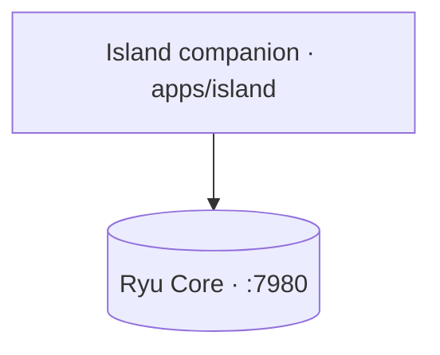

The **Island** (`apps/island`) is an Electron dynamic-island overlay that rides alongside the
desktop app on the same machine. It talks to the same Core (`:7980`), so it shares your
conversations, agents, and Gateway routing — switching from the app to the Island never switches
context.

The desktop and one-line installers preinstall the Island bundle and keep it refreshed through
Core's global Download Center. The companion is currently shipped **disabled**: it does not
autostart, appear in the node selector, or expose a Show/Hide action. When the feature is enabled,
that becomes a launch/visibility toggle without requiring users to reinstall the desktop app.

The Island **hosts the command bar** (the former standalone `apps/command` launcher was merged in).

- It runs **Shadow** context monitoring (`:3030`) plus a **local-model proactive engine** that
  surfaces suggestion chips, and a **mini chat** onto Core (`:7980`).
- A global hotkey expands the resting pill into a **command palette / mini-chat** (the `command`
  expanded view) over a `window.island` transport (`apps/island/src/renderer/command-transport.ts`),
  reusing the `@ryu/blocks` command-bar shell and the island's `island-agents` voice-agent pref.
- Every capability the companion uses is behind a **per-capability consent gate**, so nothing reads
  your screen or audio until you allow it. Consent mirrors the Core `island-consent` pref, so a
  desktop grant opens the Shadow gate without a first-run card.

## Background refresh

The Island's status and active-app views pause automatic refreshes while the window
is hidden and refresh again when it becomes visible. Slow reads settle before a new
poll starts. Revoking context access immediately hides capture details and discards
late responses from the earlier permission state.

Catalog requests have an eight-second deadline; meeting and task actions use ten
seconds. These deadlines include receiving response data, so stalled transfers do
not leave the view loading indefinitely.

Plugin contribution and UI-bundle reads use a five-second deadline. Single-response
plugin-host calls use two minutes, including their response data. Streaming agent
replies retain their separate streaming lifecycle. Completed or failed plugin streams
release their HTTP connection when the terminal event arrives. Meeting and task
subscriptions cancel pending reconnect waits when stopped and stop delivering
buffered events after cancellation.

Core probes use five seconds. Completion and speech-synthesis responses use sixty
seconds; transcription and speech processing use two minutes. These limits remain
active while receiving response data. Chat and proactive agent streams release
their connection after completion or a rejected response.

Live preference listeners share one connection to Core. Theme, voice, placement,
and other preferences still update independently; the connection closes when no
listeners remain and reconnects after a drop while listeners are active. Concurrent reads of
the same preference share their pending request; completed values are not cached.

Plugin shortcuts remain active while refreshed bindings load. Rapid preference
changes are combined into a fresh follow-up read before replacing the bindings.

Language-pack catalog refreshes pause while the Island is hidden and resume when
it becomes visible. Focus and periodic refreshes share any request already running.

Switching Companion apps starts a host scoped to the selected app. Bundle and
connection state from the previously selected app are not reused. Pending app
bundle reads are cancelled when their view closes or the requesting renderer is
destroyed.

## Appearance sync

The Island reads the Desktop's shared appearance preference through Core. Its hosted app and plugin
surfaces receive the same selected light/dark palette, custom theme colors, contrast, radius,
spacing, zoom, font stacks, cursor, overlay, motion, display timezone, and locale settings as the
Desktop Companion surface. Theme and Date & time changes update an already-open surface without
remounting it; switching the Island's window material recreates only its native window because the
compositor material is chosen at construction time.

The Island's **Background** setting controls its transparent window independently of the Desktop
window surfaces. **Translucent** keeps the floating split shape and applies a tinted in-island blur.
**Acrylic** and **Mica** construct a transparent native window and ask the operating system for its
desktop material — macOS vibrancy, or Windows acrylic/Mica when available — so the desktop can show
through as real frosted glass. Native material fills the whole window rectangle, so those modes use
a compact rounded-rectangle footprint while the translucent mode keeps the larger click-through
window needed for the fluid island morph.

<Callout type="warn">
  The Island is built, but its live hotkey summon, focus handling, and context loop are unverified:
  they need a real display to exercise. Shadow context capture is cross-platform.
</Callout>

## System-wide dictation

The Island also hosts **system-wide dictation** - a separate global shortcut (default
`CommandOrControl+Shift+D`) that captures speech and types the transcript straight into whatever
native app has OS focus. This is distinct from the Island's voice input, which drops what you say
into the Island chat to run an agent; dictation just types.

Insertion goes through **Ghost** (`apps/island/src/main/services/dictation.ts`): the transcript is
sent to Core's tool call endpoint as a `ghost.ghost_type` action with no target app, so it lands in
the currently focused window. Paste mode uses the clipboard plus a Ghost hotkey instead, and an
optional post-process step can clean the transcript up first. The shortcut deliberately never
focuses the Island - stealing focus would break typing into your target app.

<Callout type="warn">
  Dictation is a companion feature that needs a display, a microphone, and the Ghost sidecar to
  exercise, so it is not yet live-verified. The preference lives at `DICTATION_PREF_KEY`
  (`apps/island/src/shared/dictation.ts`); configure it in the desktop under the Island settings.
</Callout>

## See also

<Cards>
  <DocCard href="/docs/surfaces/desktop" />
  <DocCard href="/docs/core/conversations-sessions" />
  <DocCard href="/docs/core/node-and-presence" />
</Cards>

Continue with [Surfaces](/docs/surfaces), [Desktop user guide](/docs/surfaces/desktop/user-guide), [native bridges](/docs/extend/develop/extensions/native-bridges), [Mobile](/docs/mobile), and [Dictation app](/docs/apps/dictation).
